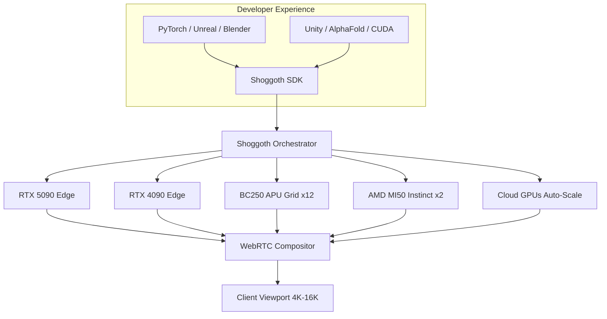

<!--
  SHOGGOTH MESH MACHINE — Root README
  
  Emerald #00FF66 + Steel #1a1a2e palette.
  Rendered by GitHub, npm, crates.io, and PyPI.
-->
<p align="center">
  <pre style="color:#00FF66;font-size:12px;line-height:1.2;text-align:center">
 ╔══════════════════════════════════════════════════════════════╗
 ║     ███████╗██╗  ██╗ ██████╗  ██████╗  ██████╗ ████████╗██╗  ██╗
 ║     ██╔════╝██║  ██║██╔═══██╗██╔════╝ ██╔════╝ ╚══██╔══╝██║  ██║
 ║     ███████╗███████║██║   ██║██║  ███╗██║  ███╗   ██║   ███████║
 ║     ╚════██║██╔══██║██║   ██║██║   ██║██║   ██║   ██║   ██╔══██║
 ║     ███████║██║  ██║╚██████╔╝╚██████╔╝╚██████╔╝   ██║   ██║  ██║
 ║     ╚══════╝╚═╝  ╚═╝ ╚═════╝  ╚═════╝  ╚═════╝    ╚═╝   ╚═╝  ╚═╝
 ║                                                           
 ║     M E S H   M A C H I N E
 ║     Virtualized Heterogeneous Hardware Fabric
 ╚══════════════════════════════════════════════════════════════╝
  </pre>
</p>

<p align="center">
  <strong>Treat diverse asymmetric multi-vendor hardware as a single parallel computing fabric.</strong>
</p>

<p align="center">
  <a href="https://github.com/chainchopper/shoggoth-backbone/blob/main/LICENSE"></a>
  <a href="https://github.com/chainchopper/shoggoth-backbone/actions"></a>
  <a href="https://www.rust-lang.org/"></a>
  <a href="https://www.python.org/"></a>
  <a href="https://crates.io/"></a>
</p>

---

## What Is Shoggoth?

Shoggoth is a **virtualized bare-metal execution spine** that runs beneath your host operating system. It unparks CPU core tracking limits, bridges heterogeneous GPUs (NVIDIA + AMD + Intel + custom APUs) into a unified fabric, and optimizes inter-process communication — all without the developer needing to know what hardware is connected.



**Key Principle**: You write code for one GPU. Shoggoth makes it run on all of them — automatically classifying the workload and routing tensor operations, ray-tracing passes, and raster jobs to the optimal hardware.

## Hardware

| Tier | Device | Role | VRAM | Cert |
|------|--------|------|------|------|
| Brain | Dual Xeon 6240 + Intel QAT | Orchestrator, 512GB DDR4 | System RAM | Full Shoggoth |
| Premium | RTX 5090 | Ray tracing, NVENC encode | 32 GB GDDR7 | Full Shoggoth |
| Premium | RTX 4090 | Ray tracing, raster | 24 GB GDDR6X | Full Shoggoth |
| Compute | RTX 3090 | CUDA compute | 24 GB GDDR6X | Limb |
| Enterprise | AMD V620 | SR-IOV cloud graphics | 32 GB HBM2 | Limb |
| Compute | 2× AMD MI50 Instinct | FP64 matrix (ROCm) | 32 GB HBM2 each | Limb |
| Grid | 12× BC250 Modded APUs | Distributed raster/compute | 12 GB GDDR6 each | Limb (144GB pool) |

**Total**: 19 nodes, 308+ GB GPU VRAM, 72 Xeon threads, 512 GB DDR4 system RAM.

## Quick Start

```bash
# Clone the monorepo
git clone https://github.com/chainchopper/shoggoth-backbone.git
cd shoggoth-backbone

# Check compilation (requires Rust 1.85+)
make check

# Run all tests
make test

# Start the orchestrator (development)
cargo run -p shoggoth-orchestrator

# In another terminal: view topology
cargo run -p shoggoth-cli -- topology

# Python client
cd clients/python && pip install -e . && python shoggoth_client.py
```

## Repository Structure

```
SHOGGOTH-AI/
├── shoggoth-backbone/          # The Engine (Rust workspace, 8 crates)
│   ├── packages/
│   │   ├── shoggoth-core/      # Hardware fabric, DMA-BUF, thread saturator
│   │   ├── shoggoth-sdk/       # Public SDK: topology, runtime, QUIC, metrics
│   │   ├── shoggoth-display/   # Compositor, hardware encoder, WebRTC
│   │   ├── shoggoth-agent/     # Workload classifier, SDK templates
│   │   └── shoggoth-node-agent/# Per-node daemon (BC250, cloud, edge)
│   ├── apps/
│   │   ├── shoggoth-cli/       # CLI: deploy, status, benchmark
│   │   ├── shoggoth-orchestrator/# Master control plane (axum REST API)
│   │   └── shoggoth-desktop/   # Tauri v2 + React dashboard
│   ├── clients/                # SDK clients (Python, TS, C, C#, Swift, Unreal)
│   ├── deploy/                 # K8s, systemd, Terraform, Grafana, Prometheus
│   ├── tests/                  # Integration tests + k6 load tests
│   └── docs/                   # mdBook + edge device spec
├── genex-platform/             # Genomics appliance (Rust, standalone)
│   └── src/                    # FASTA parser, S-W aligner, ScyllaDB, escrow
├── npu-stack/                  # ML inference hub (Python FastAPI)
│   └── backend/                # Unsloth training, Triton kernels, telemetry
└── .github/workflows/          # CI/CD (cross-platform matrix)
```

## SDK Quick Look

```rust
// Rust — Discover hardware and route workloads.
use shoggoth_sdk::topology::build_lab_topology;
use shoggoth_agent::ShoggothAgent;

let pool = build_lab_topology();
let agent = ShoggothAgent::new();
let decision = agent.analyze_and_route("import torch.nn as nn");
println!("→ {} on {}", decision.workload, decision.target.node_friendly_name);
```

```python
# Python — Async client with telemetry streaming.
from shoggoth_client import ShoggothClient

async with ShoggothClient("http://localhost:9100") as client:
    topo = await client.get_topology()
    result = await client.analyze("import torch.nn as nn")
    print(f"{result.workload} → {result.target_node}")
```

```c
// C — Zero-dependency ABI for game engines.
#include <shoggoth_sdk.h>

shoggoth_client_t* client;
shoggoth_client_connect("http://localhost:9100", &client);

shoggoth_topology_t* topo;
shoggoth_get_topology(client, &topo);
printf("Nodes: %zu, VRAM: %.1f GB\n", topo->node_count, topo->total_vram_gb);
shoggoth_topology_free(topo);
shoggoth_client_free(client);
```

## Deployment

| Method | Command |
|--------|---------|
| Bare-metal | `sudo systemctl enable --now shoggoth-orchestrator` |
| Docker | `docker compose -f docker-compose.shoggoth.yml up -d` |
| Kubernetes | `kubectl apply -f deploy/kubernetes/shoggoth-k8s.yml` |
| Terraform (AWS) | `cd deploy/terraform && terraform apply` |

## Documentation

- **Execution Plan**: [`planning.md`](planning.md) — 8 phases, 80+ trackable checkboxes.
- **SDK Docs**: [`docs/SUMMARY.md`](docs/SUMMARY.md) — Architecture, crate overview, templates.
- **Edge Device Spec**: [`docs/edge-device-spec.md`](docs/edge-device-spec.md) — 4 hardware tiers, ShoggothOS.
- **Changelog**: [`CHANGELOG.md`](CHANGELOG.md) — Full v0.1.0 log.

## Architecture Principles

1. **Zero system-wide locks**. Hot paths use `dashmap`, `crossbeam-channel`, and atomics — never `std::sync::Mutex`.
2. **Never transfer model weights over the network**. Weights live permanently cached in each node's VRAM. Only activation tensors cross the wire.
3. **All `unsafe` blocks require `// SAFETY:` comments** citing kernel/driver guarantees.
4. **`#[deny(unsafe_code)]`** on all crates except `shoggoth-core`.
5. **No blocking I/O inside `async` context**. Use `tokio::task::spawn_blocking` for FFI/FS calls.

## Contributing

1. Fork the repo.
2. Create a feature branch: `git checkout -b feat/my-feature`.
3. Run `make lint` and `make test` before committing.
4. Open a PR against `main`.

See [`CONTRIBUTING.md`](CONTRIBUTING.md) for detailed guidelines.

## License

Shoggoth Backbone & SDK: **Apache-2.0**.  
GENEx Platform: **UNLICENSED** (proprietary, all rights reserved).  
NPU-STACK: See separate repository at [`chainchopper/npu-stack`](https://github.com/chainchopper/npu-stack).

---

<p align="center">
  <em>LEAVE NO ACCELERATOR IDLE. DEPLOY THE BACKBONE IN NATIVE RUST.</em>
</p>
